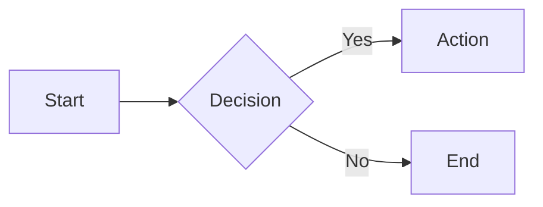

Markdown Cheat Sheet — Complete Syntax Quick Reference (2026)
Craft Markdown
Craft Markdown
Converters
Safety & Security
QUICK REFERENCE • 2026
Markdown Cheat Sheet
Every markdown syntax element in one place — with copy-paste examples, rendered previews, and tips for CommonMark and GitHub Flavored Markdown.
Markdown is the universal formatting language of the internet. GitHub, Reddit, Stack Overflow, Obsidian, Discord, documentation platforms, blogging tools, and AI assistants all use it. Once you know markdown, you can write formatted content anywhere.

This cheat sheet covers everything — standard CommonMark syntax plus GitHub Flavored Markdown (GFM) extensions. Every example is copy-paste ready.

Headings

# Heading 1
## Heading 2
### Heading 3
#### Heading 4
##### Heading 5
###### Heading 6
Alternative syntax (H1 and H2 only):

Heading 1
=========

Heading 2
---------
Best practices:

Use one # (H1) per document — it's the page title
Don't skip levels — go ## → ###, not ## → ####
Add a blank line before and after every heading
Use headings to create document structure, not for visual styling
Text Formatting

| What you want | What you type | What you get |
| --- | --- | --- |
| Bold | `**bold text**` | **bold text** |
| Italic | `*italic text*` | *italic text* |
| Bold + Italic | `***bold and italic***` | ***bold and italic*** |
| Strikethrough | `~~crossed out~~` | ~~crossed out~~ |
| Inline code | `` `code` `` | `code` |
| Subscript | `H~2~O` | H~2~O (extension) |
| Superscript | `X^2^` | X^2^ (extension) |
You can also use underscores: _italic_ and __bold__. Asterisks are more common and work in more places (mid-word emphasis, for example).

Simple examples:

- Bold: `**bold**`
- Italic: `*italic*`
- Bold + italic: `***bold italic***`

Paragraphs and Line Breaks

Paragraphs are separated by a blank line:

This is the first paragraph.

This is the second paragraph.
For a line break without a new paragraph, end the line with two spaces or use <br>:

First line with two trailing spaces  
Second line (same paragraph, new line)

Or use HTML:<br>
This also creates a line break.
Lists

Unordered Lists

- First item
- Second item
- Third item
    - Indented item
    - Another indented item
        - Double indented
          Also works with * or +:

* Asterisk item
+ Plus item
- Dash item (most common)
  Ordered Lists

1. First item
2. Second item
3. Third item
    1. Sub-item a
    2. Sub-item b
       Numbers don't need to be sequential — markdown auto-numbers:

1. First
1. Second (renders as 2)
1. Third (renders as 3)
   This is useful when you're frequently reordering items — you don't have to renumber.

Task Lists (GitHub Flavored Markdown)

- [x] Completed task
- [ ] Incomplete task
- [ ] Another task
  Renders as interactive checkboxes on GitHub.

Nesting Lists with Content

You can include paragraphs, code blocks, and other elements inside list items by indenting:

1. First item

   Additional paragraph for the first item.

2. Second item

   ```python
   print("Code block inside a list item")
Third item

---

## Links

### Inline Links

```markdown
[Link text](https://example.com)
[Link with title](https://example.com "Hover to see this title")
Reference Links

Check out [this article][ref1] and [that guide][ref2].

[ref1]: https://example.com/article "Article Title"
[ref2]: https://example.com/guide "Guide Title"
Reference links keep your text clean when you have many URLs. Define all references at the bottom of the document.

Auto-Links

<https://example.com>
<email@example.com>
Most markdown processors also auto-link bare URLs: https://example.com

Section Links (Anchors)

[Jump to the Tables section](#tables)
[Back to top](#heading-1)
The anchor is the heading text, lowercased, with spaces replaced by hyphens and special characters removed.

Images

Inline Images


Reference Images

![Alt text][img-ref]

[img-ref]: https://example.com/image.jpg "Image title"
Linked Images (Clickable)

[](https://example.com)
Wrapping an image in a link makes it clickable.

Image Best Practices

Always include descriptive alt text for accessibility and SEO
Use relative paths for images in the same repository: 
For large images, consider linking to a full-size version instead of inlining it
Code

Inline Code

Use the `console.log()` function to debug.
The `--verbose` flag enables detailed output.
Fenced Code Blocks

Use triple backticks with a language identifier for syntax highlighting:

```python
def greet(name):
    return f"Hello, {name}!"

print(greet("world"))
```
```javascript
const greeting = (name) => `Hello, ${name}!`;
console.log(greeting("world"));
```
```bash
git add .
git commit -m "Initial commit"
git push origin main
```
Common language identifiers: python, javascript, typescript, bash, shell, html, css, json, yaml, sql, go, rust, java, c, cpp, ruby, php, markdown, diff, plaintext

Indented Code Blocks

Indent every line by 4 spaces (less common than fenced blocks):

    function hello() {
        console.log("Hello!");
    }
Diff Syntax

Show additions and deletions:

```diff
- const old = "remove this line";
+ const updated = "add this line";
  const unchanged = "this stays";
```
Tables

Basic Table

| Header 1 | Header 2 | Header 3 |
|----------|----------|----------|
| Cell 1   | Cell 2   | Cell 3   |
| Cell 4   | Cell 5   | Cell 6   |
Column Alignment

| Left-aligned | Center-aligned | Right-aligned |
|:-------------|:--------------:|--------------:|
| Left         |    Center      |         Right |
| text         |     text       |          text |
:--- or --- — left-aligned (default)
:---: — center-aligned
---: — right-aligned
Table Tips

Columns don't need to be perfectly aligned in the source — just make sure pipes are present
Escape pipes within cells with \|
Every table must have a header row and a separator row
Tables must have at least two rows (header + separator)
Don't want to build tables by hand? Convert from CSV or Excel with Craft Markdown — drag, drop, and get a perfectly formatted markdown table.

Blockquotes

Simple Blockquote

> This is a blockquote. It's used for quoting text
> from another source or highlighting important information.
Multi-Paragraph Blockquote

> First paragraph of the quote.
>
> Second paragraph, still part of the same blockquote.
Nested Blockquotes

> Outer quote
>
>> Nested quote — a quote within a quote
>>
>>> Deeply nested — useful for threaded conversations
Blockquotes with Other Elements

> ### Heading inside a blockquote
>
> - List item one
> - List item two
>
> **Bold text** and `inline code` work inside blockquotes too.
Horizontal Rules

Any of these produce a horizontal line:

---

***

___
Use three or more characters. Add blank lines before and after for reliable rendering.

Escaping Characters

Use a backslash to display characters that have special meaning in markdown:

\* Not italic \*
\# Not a heading
\| Not a table pipe
\[ Not a link \]
\` Not inline code \`
\- Not a list item
Characters you can escape: \ ` * _ { } [ ] ( ) # + - . ! |

HTML in Markdown

Most markdown processors support inline HTML for elements that markdown can't express:

<details>
<summary>Click to expand</summary>

Hidden content goes here. Supports **markdown** inside.

</details>
Press <kbd>Ctrl</kbd> + <kbd>C</kbd> to copy.
This is <mark>highlighted text</mark> using HTML.
Useful HTML elements in markdown:

Element	Purpose	Example
<details> + <summary>	Collapsible sections	FAQ, long code blocks
<br>	Explicit line break	Forcing newlines
<kbd>	Keyboard keys	Shortcuts documentation
<mark>	Highlighted text	Drawing attention
<sup> / <sub>	Super/subscript	Footnotes, chemistry
&lt;dl&gt; + &lt;dt&gt; + &lt;dd&gt;	Definition lists	Glossaries
Extended Syntax (GitHub Flavored Markdown)

These features aren't part of standard CommonMark but are widely supported, especially on GitHub.

Footnotes

Here's a sentence with a footnote.[^1]

And another with a named reference.[^note]

[^1]: This is the footnote content.
[^note]: Named footnotes work too.
Definition Lists

Markdown
: A lightweight markup language for creating formatted text

CommonMark
: A standardized specification for Markdown syntax
Supported by some processors (PHP Markdown Extra, Pandoc) but not all.

Emoji Shortcodes

:rocket: :thumbsup: :star: :warning: :white_check_mark:
Supported on GitHub, GitLab, Slack, Discord, and many other platforms.

GitHub Alerts / Admonitions

> [!NOTE]
> Useful information that users should know.

> [!TIP]
> Helpful advice for doing things better or more easily.

> [!IMPORTANT]
> Key information users need to know.

> [!WARNING]
> Urgent info that needs immediate attention.

> [!CAUTION]
> Negative potential consequences of an action.
These render as colored callout boxes on GitHub.

Mentions and References (GitHub-Specific)

@username — mentions a user
#123 — references an issue or pull request
org/repo#123 — cross-repo issue reference
SHA — references a specific commit
Mermaid Diagrams (GitHub)


GitHub renders Mermaid diagram code blocks as actual diagrams.

Quick Reference Card

The essential syntax at a glance:

Element	Syntax
Heading	# H1 ## H2 ### H3
Bold	**text**
Italic	*text*
Bold + Italic	***text***
Strikethrough	~~text~~
Link	[text](url)
Image	
Inline code	`code`
Code block	```lang
Unordered list	- item
Ordered list	1. item
Task list	- [x] done
Blockquote	> text
Table	| H1 | H2 |
Horizontal rule	---
Line break	two spaces + enter
Escape	\*literal asterisk\*
Where Markdown Is Used

Markdown is everywhere. Here's where you'll encounter it:

GitHub / GitLab / Bitbucket — README files, issues, pull requests, comments, wikis, and project documentation
Reddit — Post and comment formatting
Stack Overflow — Questions, answers, and comments
Discord — Message formatting (bold, italic, code, spoilers)
Slack — Basic message formatting (bold, italic, code, lists)
Obsidian — Notes, knowledge bases, personal wikis, and Zettelkasten systems
Notion — Page content, databases, and team documentation
Hugo / Jekyll / Astro / Eleventy — Static site generators that build websites from markdown files
MkDocs / Docusaurus / GitBook — Documentation platforms built on markdown
Ghost / Hashnode / Dev.to — Blogging platforms with markdown editors
Jupyter Notebooks — Narrative text cells between code cells
ChatGPT / Claude / Gemini — AI assistants use markdown for both input and output
Don't Want to Write Markdown by Hand?

Convert existing documents to markdown automatically:

PDF to Markdown — Extract clean markdown from any PDF
Word to Markdown — Convert DOCX and DOC files instantly
HTML to Markdown — Convert web pages and HTML content
CSV to Markdown — Create tables from CSV and spreadsheet data
Excel to Markdown — Convert XLSX spreadsheets to markdown tables
JSON to Markdown — Transform JSON data into readable markdown
All conversions are free, instant, and private — files never leave your browser.

Open the Converter →

Frequently Asked Questions

What's the difference between Markdown and HTML?

Markdown is a simplified syntax that converts to HTML. It's designed to be readable as plain text — you can understand a markdown document without rendering it. HTML is more powerful and precise but much harder to read in raw form. In practice, you write in markdown for readability and speed, and the markdown processor converts it to HTML for display.

Which markdown flavor should I use?

For most purposes, CommonMark (the standardized specification) covers everything you need. If you're writing for GitHub, use GitHub Flavored Markdown (GFM) which adds task lists, tables, strikethrough, auto-linking, and alert callouts. Most markdown processors support both. The differences are in extensions, not in core syntax.

Can I use markdown in emails?

Most email clients don't render markdown natively. However, the Markdown Here browser extension lets you write in markdown and convert to rich text before sending. Many newsletter platforms (Buttondown, Substack) also support markdown input.

How long does it take to learn markdown?

The core syntax — headings, bold, italic, lists, links, code — takes about 10 minutes to learn. Extended features (tables, footnotes, task lists) take another 10 minutes. You'll have the full syntax memorized within a week of regular use. This cheat sheet covers everything you need.

Is markdown the same everywhere?

The core syntax (headings, bold, italic, lists, links, images, code) is universal across all platforms. Extended features vary: GitHub supports task lists, alerts, and Mermaid diagrams; Obsidian supports wikilinks, callouts, and dataview; Pandoc supports citations and footnotes. This guide covers CommonMark and GFM, which together handle 95% of use cases.

What file extension should I use?

Use .md (most common). .markdown is also valid but less popular. Some tools use .mdx for Markdown + JSX (React components in markdown). For GitHub READMEs, the file must be named README.md.

Can AI assistants read and write markdown?

Yes. ChatGPT, Claude, Gemini, and other AI assistants output markdown by default — headings, bold, lists, code blocks, tables. They also process markdown input very well because they're trained on billions of markdown documents from GitHub and the web. Feeding AI clean markdown produces better results than raw text, HTML, or PDF content. See our guide on why LLMs love markdown for more.

Don't want to write markdown by hand?

Convert PDFs, Word docs, HTML, CSV, Excel, and more to clean markdown automatically. Free, instant, private.

Open the Converter
Converters

PDF to Markdown
Word to Markdown
HTML to Markdown
JSON to Markdown
Guides

How to Convert PDF to Markdown
Why LLMs Love Markdown
PDF to Markdown for RAG
Best PDF to Markdown Converters
Craft Markdown vs pdf2md
About

Safety & Security
Craft Markdown
Craft Markdown
Privacy first — all conversion happens locally in your browser
